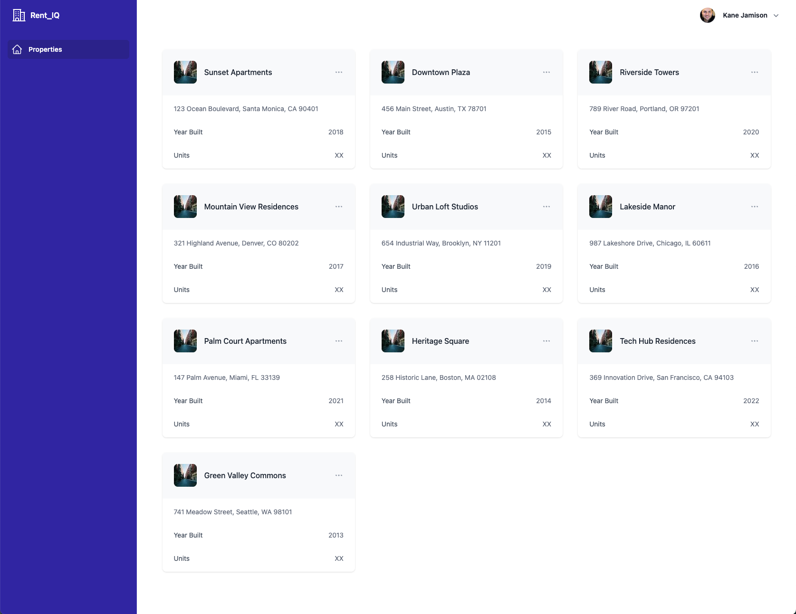
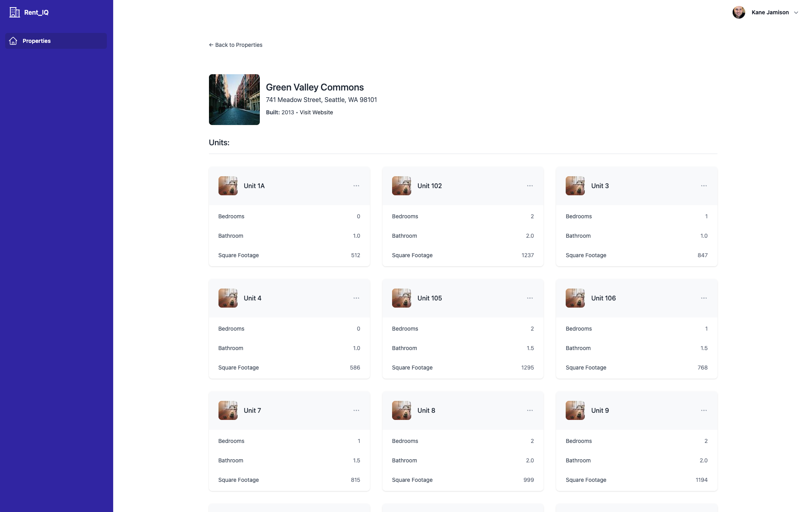

# RentIQ - Property Viewing Application

Take-home project for building a property viewing application with Rails API backend and React frontend.

## App Preview
### Backend Preview
**http://localhost:3000/properties**
``` json
[
  {
    "id": 1,
    "name": "Sunset Apartments",
    "address": "123 Ocean Boulevard, Santa Monica, CA 90401",
    "year_built": 2018,
    "website_url": "https://sunsetapts.example.com",
    "created_at": "2025-10-20T20:23:39.913Z",
    "updated_at": "2025-10-20T20:23:39.913Z"
  },
  {
    "id": 2,
    "name": "Downtown Plaza",
    "address": "456 Main Street, Austin, TX 78701",
    "year_built": 2015,
    "website_url": "https://downtownplaza.example.com",
    "created_at": "2025-10-20T20:23:39.920Z",
    "updated_at": "2025-10-20T20:23:39.920Z"
  },
...
]
```

**http://localhost:3000/properties/8**
``` json
{
  "id": 8,
  "name": "Heritage Square",
  "address": "258 Historic Lane, Boston, MA 02108",
  "year_built": 2014,
  "website_url": "https://heritagesquare.example.com",
  "created_at": "2025-10-20T20:23:39.976Z",
  "updated_at": "2025-10-20T20:23:39.976Z",
  "units": [
    {
      "id": 87,
      "name": "Unit 1A",
      "bedroom_count": 2,
      "bathroom_count": "2.0",
      "unit_size": 1232,
      "property_id": 8,
      "created_at": "2025-10-20T21:35:17.479Z",
      "updated_at": "2025-10-20T21:35:17.479Z"
    },
    {
      "id": 88,
      "name": "Unit 2",
      "bedroom_count": 2,
      "bathroom_count": "2.0",
      "unit_size": 938,
      "property_id": 8,
      "created_at": "2025-10-20T21:35:17.480Z",
      "updated_at": "2025-10-20T21:35:17.480Z"
    },
...
}
```

### Frontend Preview

**Property Listings**


**Property Detail & Unit Listings**



## Project Status

### Backend Tasks
- [x] Initialize Rails API-only application
- [x] Configure sqlite database
- [x] Create Property model (name, address, year_built, website_url)
  - [x] Bonus: Added DB seeds for 10 properties.
- [x] Implement API endpoint: List all properties
  - Our route at http://localhost:3000/properties is working fine... do we need to add additional API functionality?
- [x] Implement API endpoint: View single property
  - Our route at http://localhost:3000/properties/10 is working fine... do we need to add additional API functionality?
- [x] Configure CORS for frontend communication

### Frontend Tasks
- [x] Initialize React application with Vite
- [x] Set up Tailwind CSS
- [x] Install API call dependencies (axios/fetch)
- [x] Create properties list view
- [x] Display property details (name, address, year built, website link)
- [x] Configure API connection to localhost:3000
- [x] Optional: Create detail view for individual properties

### Bonus Tasks (If Time Permits)
- [x] Backend: Create Units model (unit_name, bedroom_count, bathroom_count, unit_size)
- [x] Backend: Add relationship between Property and Units
  - [x] Bonus: Added DB seeds for 4-24 units per property.
- [x] Backend: Update API endpoints to include units
    - Can be fetched via http://localhost:3000/properties/8 or http://localhost:3000/properties/8/units
- [x] Frontend: Display units associated with properties

## Running the Applications

### Backend (Rails API)
```bash
# Initial setup
cd backend
bundle install
rails db:create
rails db:migrate
rails db:seed

# Run the server (on port 3000)
bin/dev
```

### Frontend (React + Vite)
```bash
cd frontend

# Initial setup
npm install

# Run the server (port 5173)
npm run dev
```

## Notes for Interviewing Team

### Backend Choices
- Using standard Rails scaffolds for controllers returning JSON responses.
  - `rails generate scaffold Property name:string address:text year_built:integer website_url:string`
  - `rails generate scaffold Unit unit_name:string bedroom_count:integer bathroom_count:decimal unit_size:integer property:references`
- I'm able to load JSON responses fine directly from Rails default scaffolding, including full CRUD examples below tested on localhost, so pausing here.
  - Do we need a more robust API design for this project?
  - I assume we don't need authentication or authorization for this project.
  - I assume we're ok exposing all database columns publicly and don't need to filter currently.

### Frontend Choices
- I'm using Tailwind UI blocks and app layouts for simplicity.
  - I've tweaked some of the default Tailwind styles for layout and personal preferences but there's plenty of room for UI improvement, and thinks like better link wrapping on cards, etc. Trying to stay within scope and not go overboard.
- I implemented a very raw URL handling to set URLs with pushState and accept them in App.jsx if user enters through a property URL instead of homepage. Definitely not meant to be a robust implementation or full routing system.

### Repo Choices
- I have committed everything directly to main for speed. Don't judge me too harshly =).
  - I typically prefer to work in small reviewable PRs whenever possible with good PR notes.
  - I use descriptive commit names but I don't like to include a lot in commit messages since it gets lost in the PR itself.
  - I like running everything through PRs even on personal projects just to get full CI feedback before squash and merge.

### API CRUD Reference
All of the following were QA'd and working as expected.

**CREATE**
```
curl -X POST http://localhost:3000/properties -H "Content-Type: application/json" -d '{"property": {"name": "Test Property", "address": "123 Test Street, Test City, TC 12345", "year_built": 2023, "website_url": "https://testproperty.example.com"}}'
```

**UPDATE - Update property 11**
```
curl -X PATCH http://localhost:3000/properties/11 -H "Content-Type: application/json" -d '{"property": {"name": "Updated Test Property"}}'
```

**DELETE - Delete property 11**
```
curl -X DELETE http://localhost:3000/properties/11
```

### Trade-offs and Future Improvements
- properties
  - single address line is good enough for this project but I'd probably implement a more robust address line 1, etc for production.

### AI Usage
- All code was written by me (or pasted in the case of 2 Tailwind UI components).
- Claude was pulled in to generate the following items that were beyond the core specs:
- App:
  - Building out supporting files like Readme.
- Backend:
  - Generate db seeds

---

## Take-Home Project Requirements

### Overview

You will be building a property viewing application consisting of two separate applications that communicate via API:

1. A Rails API backend
2. A React frontend using Vite

### AI Usage

You should not use AI tools to write any of the code for this. The goal of this project is to ensure you understand and feel confident building upon this code as in the next set of interviews, you will be making improvements on it with the team. You may use AI tools for questions about topics, acting as a replacement for a Google search.

### Backend Requirements (Rails API)

#### Application Setup

- Initialize a new Rails application in API-only mode
- Use sqlite as your database

#### Data Model

Create a data model for properties with the following attributes:

- Property Name
- Address
- Year Built
- Website URL

#### API Endpoints

Implement endpoints for:

- Listing all properties
- Viewing a single property

### Frontend Requirements (React + Vite)

#### Application Setup

- Initialize a new React application using Vite
- Set up Tailwind CSS for styling
- Install necessary dependencies for making API calls

#### Core Functionality

Build a user interface that:

- Displays a list of all properties showing:
  - Property Name
  - Address
  - Year Built
  - Hyperlink to website URL
- Optionally includes a detail view for individual properties

#### Technical Requirements

- Use modern React patterns (hooks, functional components)
- Connect to the Rails API running on port 3000
- Style the interface using Tailwind CSS

### Connection Between Applications

- The Rails API should run on port 3000
- The React application should run on port 5173 (Vite's default)
- All API calls from React should be made to the Rails backend

### Getting Started Tips

- Use Rails generators to quickly scaffold models and controllers
- Use Vite's React template to bootstrap the frontend
- Remember to handle CORS configuration in Rails
- Consider using a library like axios or fetch for API calls in React
- Host the code on a publicly available github repository

### Bonus Section

If time permits, extend the Property model to include:

- A relationship to units
- Units model with unit name, bedroom count, bathroom count, unit size
- Update the API and frontend to display units associated with properties
